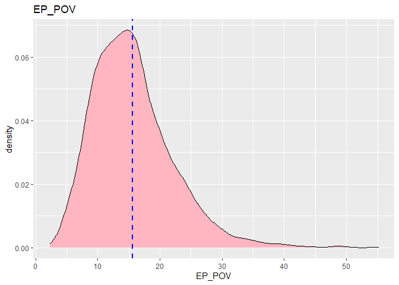
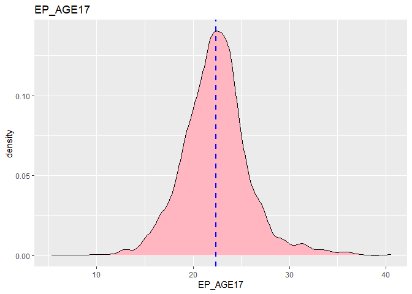
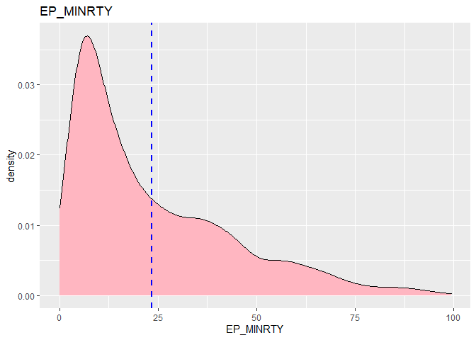
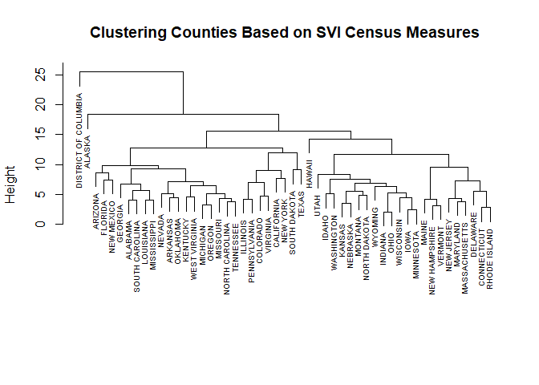
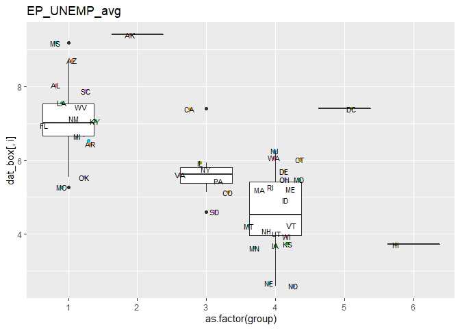
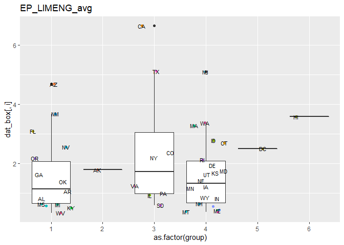

<<<<<<< HEAD
SVI\_COVID
================
John Rollman
July 5, 2021

-   [Packages Used](#packages-used)
    -   [Density Plots](#density-plots)
    -   [Observing Death and Case
        Distributions](#observing-death-and-case-distributions)
    -   [Trying a Poisson model using a rate of deaths per
        cases](#trying-a-poisson-model-using-a-rate-of-deaths-per-cases)
    -   [Trying a quasipoisson model](#trying-a-quasipoisson-model)
    -   [Trying a binomial model](#trying-a-binomial-model)
    -   [Checking multicollinearity](#checking-multicollinearity)
    -   [Reducing multicolinearity with dimension
        reduction](#reducing-multicolinearity-with-dimension-reduction)
        -   [Using Exploratory Factor Analysis to reduce
            collinearity](#using-exploratory-factor-analysis-to-reduce-collinearity)
        -   [Using PCA to reduce
            collinerarity](#using-pca-to-reduce-collinerarity)
        -   [Checking PCA relationships](#checking-pca-relationships)
    -   [Trying a binomial model with the first 6
        PCs](#trying-a-binomial-model-with-the-first-6-pcs)

# Packages Used

``` r
library(tidyverse) #Data manipulation and formatting
library(knitr) #Report tools and formatting
library(corrplot) #Pretty correlation plots
library(tidymodels) #Multiuse package containing many models
library(sem) #Structural equation models for CFA
library(psych) #Exploratory factor models
library(randomForest) #Classification trees also in caret
library(gbm) #Logistic classifies for caret and other packages
library(DiagrammeR)
library(rattle)
library(kableExtra)
library(class)
library(ape)
library(readxl)
library(visdat)
library(naniar)
library(janitor)
library(correlationfunnel)
library(Hmisc)
library(xgboost)
library(vip)
library(RColorBrewer)
library(MVN)
```

\#Load in Data

``` r
sviDat <- read.csv("SVI2018_US_COUNTY.csv") %>% #Load CSV provided by CDC website
  select(c(STATE,ST_ABBR,COUNTY,FIPS, E_TOTPOP)|starts_with('EP_')) %>% #For this analysis we will be using the percent values for the measures rather than raw values
  replace(., . ==-999, NA) %>% #Excluding counties with missing data
  na.omit()

#head(sviDat)
kable(head(sviDat), caption = "Preview of SVI Data", digits = 1, format = 'html') %>%
  kable_styling() %>%
  kableExtra::scroll_box(width = "100%", height = "375px")
```

<div
style="border: 1px solid #ddd; padding: 0px; overflow-y: scroll; height:375px; overflow-x: scroll; width:100%; ">

<table class="table" style="margin-left: auto; margin-right: auto;">
<caption>
Preview of SVI Data
</caption>
<thead>
<tr>
<th style="text-align:left;position: sticky; top:0; background-color: #FFFFFF;">
</th>
<th style="text-align:left;position: sticky; top:0; background-color: #FFFFFF;">
STATE
</th>
<th style="text-align:left;position: sticky; top:0; background-color: #FFFFFF;">
ST\_ABBR
</th>
<th style="text-align:left;position: sticky; top:0; background-color: #FFFFFF;">
COUNTY
</th>
<th style="text-align:right;position: sticky; top:0; background-color: #FFFFFF;">
FIPS
</th>
<th style="text-align:right;position: sticky; top:0; background-color: #FFFFFF;">
E\_TOTPOP
</th>
<th style="text-align:right;position: sticky; top:0; background-color: #FFFFFF;">
EP\_POV
</th>
<th style="text-align:right;position: sticky; top:0; background-color: #FFFFFF;">
EP\_UNEMP
</th>
<th style="text-align:right;position: sticky; top:0; background-color: #FFFFFF;">
EP\_PCI
</th>
<th style="text-align:right;position: sticky; top:0; background-color: #FFFFFF;">
EP\_NOHSDP
</th>
<th style="text-align:right;position: sticky; top:0; background-color: #FFFFFF;">
EP\_AGE65
</th>
<th style="text-align:right;position: sticky; top:0; background-color: #FFFFFF;">
EP\_AGE17
</th>
<th style="text-align:right;position: sticky; top:0; background-color: #FFFFFF;">
EP\_DISABL
</th>
<th style="text-align:right;position: sticky; top:0; background-color: #FFFFFF;">
EP\_SNGPNT
</th>
<th style="text-align:right;position: sticky; top:0; background-color: #FFFFFF;">
EP\_MINRTY
</th>
<th style="text-align:right;position: sticky; top:0; background-color: #FFFFFF;">
EP\_LIMENG
</th>
<th style="text-align:right;position: sticky; top:0; background-color: #FFFFFF;">
EP\_MUNIT
</th>
<th style="text-align:right;position: sticky; top:0; background-color: #FFFFFF;">
EP\_MOBILE
</th>
<th style="text-align:right;position: sticky; top:0; background-color: #FFFFFF;">
EP\_CROWD
</th>
<th style="text-align:right;position: sticky; top:0; background-color: #FFFFFF;">
EP\_NOVEH
</th>
<th style="text-align:right;position: sticky; top:0; background-color: #FFFFFF;">
EP\_GROUPQ
</th>
<th style="text-align:right;position: sticky; top:0; background-color: #FFFFFF;">
EP\_UNINSUR
</th>
</tr>
</thead>
<tbody>
<tr>
<td style="text-align:left;">
2
</td>
<td style="text-align:left;">
ALABAMA
</td>
<td style="text-align:left;">
AL
</td>
<td style="text-align:left;">
Autauga
</td>
<td style="text-align:right;">
1001
</td>
<td style="text-align:right;">
55200
</td>
<td style="text-align:right;">
15.4
</td>
<td style="text-align:right;">
4.2
</td>
<td style="text-align:right;">
29372
</td>
<td style="text-align:right;">
11.3
</td>
<td style="text-align:right;">
14.6
</td>
<td style="text-align:right;">
24.2
</td>
<td style="text-align:right;">
19.3
</td>
<td style="text-align:right;">
7.5
</td>
<td style="text-align:right;">
25.0
</td>
<td style="text-align:right;">
0.8
</td>
<td style="text-align:right;">
3.8
</td>
<td style="text-align:right;">
18.4
</td>
<td style="text-align:right;">
1.4
</td>
<td style="text-align:right;">
5.6
</td>
<td style="text-align:right;">
1.0
</td>
<td style="text-align:right;">
7.1
</td>
</tr>
<tr>
<td style="text-align:left;">
3
</td>
<td style="text-align:left;">
ALABAMA
</td>
<td style="text-align:left;">
AL
</td>
<td style="text-align:left;">
Blount
</td>
<td style="text-align:right;">
1009
</td>
<td style="text-align:right;">
57645
</td>
<td style="text-align:right;">
14.4
</td>
<td style="text-align:right;">
4.1
</td>
<td style="text-align:right;">
22656
</td>
<td style="text-align:right;">
19.8
</td>
<td style="text-align:right;">
17.8
</td>
<td style="text-align:right;">
23.4
</td>
<td style="text-align:right;">
14.2
</td>
<td style="text-align:right;">
7.0
</td>
<td style="text-align:right;">
12.9
</td>
<td style="text-align:right;">
1.7
</td>
<td style="text-align:right;">
0.9
</td>
<td style="text-align:right;">
25.2
</td>
<td style="text-align:right;">
1.6
</td>
<td style="text-align:right;">
4.2
</td>
<td style="text-align:right;">
0.9
</td>
<td style="text-align:right;">
11.0
</td>
</tr>
<tr>
<td style="text-align:left;">
4
</td>
<td style="text-align:left;">
ALABAMA
</td>
<td style="text-align:left;">
AL
</td>
<td style="text-align:left;">
Butler
</td>
<td style="text-align:right;">
1013
</td>
<td style="text-align:right;">
20025
</td>
<td style="text-align:right;">
23.5
</td>
<td style="text-align:right;">
6.7
</td>
<td style="text-align:right;">
20430
</td>
<td style="text-align:right;">
15.4
</td>
<td style="text-align:right;">
19.0
</td>
<td style="text-align:right;">
22.8
</td>
<td style="text-align:right;">
17.7
</td>
<td style="text-align:right;">
10.5
</td>
<td style="text-align:right;">
48.1
</td>
<td style="text-align:right;">
0.5
</td>
<td style="text-align:right;">
1.3
</td>
<td style="text-align:right;">
26.2
</td>
<td style="text-align:right;">
1.8
</td>
<td style="text-align:right;">
7.8
</td>
<td style="text-align:right;">
1.6
</td>
<td style="text-align:right;">
10.2
</td>
</tr>
<tr>
<td style="text-align:left;">
5
</td>
<td style="text-align:left;">
ALABAMA
</td>
<td style="text-align:left;">
AL
</td>
<td style="text-align:left;">
Calhoun
</td>
<td style="text-align:right;">
1015
</td>
<td style="text-align:right;">
115098
</td>
<td style="text-align:right;">
18.6
</td>
<td style="text-align:right;">
8.8
</td>
<td style="text-align:right;">
24706
</td>
<td style="text-align:right;">
15.9
</td>
<td style="text-align:right;">
16.8
</td>
<td style="text-align:right;">
21.9
</td>
<td style="text-align:right;">
20.8
</td>
<td style="text-align:right;">
10.4
</td>
<td style="text-align:right;">
27.5
</td>
<td style="text-align:right;">
1.0
</td>
<td style="text-align:right;">
3.7
</td>
<td style="text-align:right;">
14.7
</td>
<td style="text-align:right;">
1.7
</td>
<td style="text-align:right;">
5.8
</td>
<td style="text-align:right;">
2.7
</td>
<td style="text-align:right;">
9.4
</td>
</tr>
<tr>
<td style="text-align:left;">
6
</td>
<td style="text-align:left;">
ALABAMA
</td>
<td style="text-align:left;">
AL
</td>
<td style="text-align:left;">
Chambers
</td>
<td style="text-align:right;">
1017
</td>
<td style="text-align:right;">
33826
</td>
<td style="text-align:right;">
16.6
</td>
<td style="text-align:right;">
5.0
</td>
<td style="text-align:right;">
22827
</td>
<td style="text-align:right;">
18.6
</td>
<td style="text-align:right;">
18.9
</td>
<td style="text-align:right;">
20.7
</td>
<td style="text-align:right;">
16.7
</td>
<td style="text-align:right;">
9.7
</td>
<td style="text-align:right;">
44.2
</td>
<td style="text-align:right;">
0.1
</td>
<td style="text-align:right;">
4.0
</td>
<td style="text-align:right;">
14.0
</td>
<td style="text-align:right;">
3.0
</td>
<td style="text-align:right;">
7.3
</td>
<td style="text-align:right;">
1.5
</td>
<td style="text-align:right;">
10.8
</td>
</tr>
<tr>
<td style="text-align:left;">
7
</td>
<td style="text-align:left;">
ALABAMA
</td>
<td style="text-align:left;">
AL
</td>
<td style="text-align:left;">
Coffee
</td>
<td style="text-align:right;">
1031
</td>
<td style="text-align:right;">
51288
</td>
<td style="text-align:right;">
15.1
</td>
<td style="text-align:right;">
5.9
</td>
<td style="text-align:right;">
27577
</td>
<td style="text-align:right;">
13.8
</td>
<td style="text-align:right;">
16.3
</td>
<td style="text-align:right;">
23.7
</td>
<td style="text-align:right;">
17.7
</td>
<td style="text-align:right;">
9.7
</td>
<td style="text-align:right;">
29.4
</td>
<td style="text-align:right;">
1.4
</td>
<td style="text-align:right;">
0.9
</td>
<td style="text-align:right;">
13.6
</td>
<td style="text-align:right;">
1.4
</td>
<td style="text-align:right;">
6.0
</td>
<td style="text-align:right;">
1.2
</td>
<td style="text-align:right;">
10.1
</td>
</tr>
</tbody>
</table>

</div>

\#Exploratory Analysis  
\#\#Summary Statistics

``` r
#Summary
kable(do.call(cbind, lapply(sviDat[,5:20], summary)), caption = "Summary Statistics for All Variables", digits = 1, format = 'html') %>%
  kable_styling() %>%
  kableExtra::scroll_box(width = "100%", height = "375px")
```

<div
style="border: 1px solid #ddd; padding: 0px; overflow-y: scroll; height:375px; overflow-x: scroll; width:100%; ">

<table class="table" style="margin-left: auto; margin-right: auto;">
<caption>
Summary Statistics for All Variables
</caption>
<thead>
<tr>
<th style="text-align:left;position: sticky; top:0; background-color: #FFFFFF;">
</th>
<th style="text-align:right;position: sticky; top:0; background-color: #FFFFFF;">
E\_TOTPOP
</th>
<th style="text-align:right;position: sticky; top:0; background-color: #FFFFFF;">
EP\_POV
</th>
<th style="text-align:right;position: sticky; top:0; background-color: #FFFFFF;">
EP\_UNEMP
</th>
<th style="text-align:right;position: sticky; top:0; background-color: #FFFFFF;">
EP\_PCI
</th>
<th style="text-align:right;position: sticky; top:0; background-color: #FFFFFF;">
EP\_NOHSDP
</th>
<th style="text-align:right;position: sticky; top:0; background-color: #FFFFFF;">
EP\_AGE65
</th>
<th style="text-align:right;position: sticky; top:0; background-color: #FFFFFF;">
EP\_AGE17
</th>
<th style="text-align:right;position: sticky; top:0; background-color: #FFFFFF;">
EP\_DISABL
</th>
<th style="text-align:right;position: sticky; top:0; background-color: #FFFFFF;">
EP\_SNGPNT
</th>
<th style="text-align:right;position: sticky; top:0; background-color: #FFFFFF;">
EP\_MINRTY
</th>
<th style="text-align:right;position: sticky; top:0; background-color: #FFFFFF;">
EP\_LIMENG
</th>
<th style="text-align:right;position: sticky; top:0; background-color: #FFFFFF;">
EP\_MUNIT
</th>
<th style="text-align:right;position: sticky; top:0; background-color: #FFFFFF;">
EP\_MOBILE
</th>
<th style="text-align:right;position: sticky; top:0; background-color: #FFFFFF;">
EP\_CROWD
</th>
<th style="text-align:right;position: sticky; top:0; background-color: #FFFFFF;">
EP\_NOVEH
</th>
<th style="text-align:right;position: sticky; top:0; background-color: #FFFFFF;">
EP\_GROUPQ
</th>
</tr>
</thead>
<tbody>
<tr>
<td style="text-align:left;">
Min.
</td>
<td style="text-align:right;">
75.0
</td>
<td style="text-align:right;">
2.3
</td>
<td style="text-align:right;">
0.0
</td>
<td style="text-align:right;">
10148.0
</td>
<td style="text-align:right;">
1.2
</td>
<td style="text-align:right;">
3.8
</td>
<td style="text-align:right;">
5.3
</td>
<td style="text-align:right;">
3.8
</td>
<td style="text-align:right;">
0.0
</td>
<td style="text-align:right;">
0.0
</td>
<td style="text-align:right;">
0.0
</td>
<td style="text-align:right;">
0.0
</td>
<td style="text-align:right;">
0.0
</td>
<td style="text-align:right;">
0.0
</td>
<td style="text-align:right;">
0.0
</td>
<td style="text-align:right;">
0.0
</td>
</tr>
<tr>
<td style="text-align:left;">
1st Qu.
</td>
<td style="text-align:right;">
10948.0
</td>
<td style="text-align:right;">
11.0
</td>
<td style="text-align:right;">
4.0
</td>
<td style="text-align:right;">
22767.0
</td>
<td style="text-align:right;">
8.8
</td>
<td style="text-align:right;">
15.4
</td>
<td style="text-align:right;">
20.3
</td>
<td style="text-align:right;">
12.9
</td>
<td style="text-align:right;">
6.6
</td>
<td style="text-align:right;">
7.3
</td>
<td style="text-align:right;">
0.3
</td>
<td style="text-align:right;">
1.3
</td>
<td style="text-align:right;">
5.3
</td>
<td style="text-align:right;">
1.2
</td>
<td style="text-align:right;">
4.2
</td>
<td style="text-align:right;">
1.2
</td>
</tr>
<tr>
<td style="text-align:left;">
Median
</td>
<td style="text-align:right;">
25735.0
</td>
<td style="text-align:right;">
14.7
</td>
<td style="text-align:right;">
5.4
</td>
<td style="text-align:right;">
26245.0
</td>
<td style="text-align:right;">
12.1
</td>
<td style="text-align:right;">
18.0
</td>
<td style="text-align:right;">
22.3
</td>
<td style="text-align:right;">
15.4
</td>
<td style="text-align:right;">
8.1
</td>
<td style="text-align:right;">
16.1
</td>
<td style="text-align:right;">
0.7
</td>
<td style="text-align:right;">
2.9
</td>
<td style="text-align:right;">
10.9
</td>
<td style="text-align:right;">
1.9
</td>
<td style="text-align:right;">
5.6
</td>
<td style="text-align:right;">
2.0
</td>
</tr>
<tr>
<td style="text-align:left;">
Mean
</td>
<td style="text-align:right;">
102790.1
</td>
<td style="text-align:right;">
15.6
</td>
<td style="text-align:right;">
5.8
</td>
<td style="text-align:right;">
27036.5
</td>
<td style="text-align:right;">
13.4
</td>
<td style="text-align:right;">
18.4
</td>
<td style="text-align:right;">
22.4
</td>
<td style="text-align:right;">
15.9
</td>
<td style="text-align:right;">
8.3
</td>
<td style="text-align:right;">
23.5
</td>
<td style="text-align:right;">
1.7
</td>
<td style="text-align:right;">
4.7
</td>
<td style="text-align:right;">
12.9
</td>
<td style="text-align:right;">
2.4
</td>
<td style="text-align:right;">
6.4
</td>
<td style="text-align:right;">
3.5
</td>
</tr>
<tr>
<td style="text-align:left;">
3rd Qu.
</td>
<td style="text-align:right;">
67253.0
</td>
<td style="text-align:right;">
19.1
</td>
<td style="text-align:right;">
7.1
</td>
<td style="text-align:right;">
30109.0
</td>
<td style="text-align:right;">
17.2
</td>
<td style="text-align:right;">
20.8
</td>
<td style="text-align:right;">
24.1
</td>
<td style="text-align:right;">
18.5
</td>
<td style="text-align:right;">
9.8
</td>
<td style="text-align:right;">
35.2
</td>
<td style="text-align:right;">
1.9
</td>
<td style="text-align:right;">
5.8
</td>
<td style="text-align:right;">
18.7
</td>
<td style="text-align:right;">
2.9
</td>
<td style="text-align:right;">
7.6
</td>
<td style="text-align:right;">
3.8
</td>
</tr>
<tr>
<td style="text-align:left;">
Max.
</td>
<td style="text-align:right;">
10098052.0
</td>
<td style="text-align:right;">
55.1
</td>
<td style="text-align:right;">
28.9
</td>
<td style="text-align:right;">
72832.0
</td>
<td style="text-align:right;">
66.3
</td>
<td style="text-align:right;">
55.6
</td>
<td style="text-align:right;">
40.5
</td>
<td style="text-align:right;">
33.7
</td>
<td style="text-align:right;">
25.7
</td>
<td style="text-align:right;">
99.3
</td>
<td style="text-align:right;">
30.4
</td>
<td style="text-align:right;">
89.4
</td>
<td style="text-align:right;">
59.3
</td>
<td style="text-align:right;">
49.3
</td>
<td style="text-align:right;">
87.8
</td>
<td style="text-align:right;">
55.7
</td>
</tr>
</tbody>
</table>

</div>

## Density Plots

``` r
#Create Density Plots
for(i in 5:20) {
a <- ggplot(sviDat,aes(sviDat[,i])) + 
  geom_density(kernel = "gaussian", fill = 'lightpink') +
  geom_vline(aes(xintercept=mean(sviDat[,i])), color="blue", linetype="dashed", size=1) +
  ggtitle(colnames(sviDat)[i]) +
  labs( x = colnames(sviDat)[i])
print(a)
}
```

<!-- --><!-- --><!-- --><!-- --><!-- --><!-- --><!-- --><!-- --><!-- --><!-- --><!-- --><!-- --><!-- --><!-- --><!-- --><!-- -->

\#Clustering Counties, States, and Variables

``` r
# Clustering the variables base on correlation
SVI_hc_corr <- hclust(as.dist(1-abs(cor(scale(sviDat[,6:20])))))
plot(as.phylo(SVI_hc_corr), type = "fan", cex=.6)
```

<!-- -->

``` r
# Using hierarchical Clustering. Since all variables are percentages, there is not a big need to center and scale here.
SVI_hc <- hclust(dist(scale(sviDat[,6:20])), method = "complete") #Not using the calculated RPL themes to cluster
plot(SVI_hc, main='Clustering Counties Based on SVI Census Measures', xlab="", sub="", cex=.2)
```

<!-- -->

``` r
# Summarizing on state and taking the average county values
sviDat_state_pop <- sviDat %>%
  select(STATE,E_TOTPOP) %>%
  group_by(STATE) %>%
  summarise(st_TOTPOP = sum(E_TOTPOP)) 


sviDat_state <- sviDat %>%
  select(!c(COUNTY,FIPS,E_TOTPOP)) %>%
  group_by(STATE, ST_ABBR) %>%
  summarise(across(everything(), list(avg = mean, min = min, max = max))) 
```

    ## `summarise()` has grouped output by 'STATE'. You can override using the
    ## `.groups` argument.

``` r
# Clustering States  
SVI_hc_st <- hclust(dist(scale(sviDat_state[,3:50])), method = "complete")
SVI_hc_st$labels <- sviDat_state$STATE
plot(SVI_hc_st, main='Clustering Counties Based on SVI Census Measures', xlab="", sub="", cex=.6)
```

<!-- -->

``` r
sviDat_st_c <- sviDat_state
sviDat_st_c$group <- cutree(SVI_hc_st, 6)

tabyl(sviDat_st_c$group)
```

    ##  sviDat_st_c$group  n    percent
    ##                  1 18 0.35294118
    ##                  2  1 0.01960784
    ##                  3  8 0.15686275
    ##                  4 22 0.43137255
    ##                  5  1 0.01960784
    ##                  6  1 0.01960784

``` r
colors <- brewer.pal(n=6, name='Dark2')
cluscomp <- cutree(SVI_hc_st, 6)
plot(as.phylo(SVI_hc_st), type = 'fan', tip.color = colors[cluscomp], label.offset =.8, cex = .6)
```

<!-- -->

``` r
st_grp <- sviDat_st_c %>%
  group_by(STATE) %>%
  summarise(st_grp = max(group))
```

\#\#Exploring the clusters

``` r
dat_box <- sviDat_st_c %>%
  select(ends_with('avg') | c(STATE, ST_ABBR, group)) %>%
  as.data.frame()


#Create Boxplots for 6 clusters
for(i in 1:16) {
a <- ggplot(dat_box,aes(x = as.factor(group), y=dat_box[,i])) +
  geom_jitter(aes(color=STATE), position = position_jitter(seed = 1)) +
  geom_boxplot() +
  ggtitle(colnames(dat_box)[i]) +
  theme(legend.position = "none") +
  geom_text(position = position_jitter(seed = 1),check_overlap = TRUE, size = 3, aes(label=ST_ABBR))
print(a)
}
```

<!-- --><!-- --><!-- --><!-- --><!-- --><!-- --><!-- --><!-- --><!-- --><!-- --><!-- --><!-- --><!-- --><!-- --><!-- --><!-- -->

\#Assessing SVI and COVID Impacts  
\#\# Get Data from CDC API

``` r
library("RSocrata")
```

    ## Warning: package 'RSocrata' was built under R version 4.1.3

``` r
cnty_covDat <- read.socrata(
  "https://data.cdc.gov/resource/kn79-hsxy.json",
  app_token = token, 
  email     = email,
  password  = pswd
)

cnty_Dat <- cnty_covDat  %>%
  select(county_fips_code, total_death, covid_death) %>%
  rename(FIPS=county_fips_code) %>%
  mutate(FIPS = as.integer(FIPS)) %>%
  inner_join(sviDat, by = 'FIPS', keep=F) %>%
  inner_join(st_grp, by = 'STATE')


st_covDat <- read.socrata(
  "https://data.cdc.gov/resource/9mfq-cb36.json",
  app_token = token, 
  email     = email,
  password  = pswd
) %>% 
  select(state,tot_cases,tot_death) %>%
  group_by(state) %>%
  summarise(tot_cases = max(tot_cases), tot_death=max(tot_death)) %>%
  rename(ST_ABBR = state) %>%
  inner_join(dat_box, by = 'ST_ABBR') %>%
  inner_join(sviDat_state_pop, by = 'STATE') %>%
  mutate(tot_cases = as.numeric(tot_cases), tot_death=as.numeric(tot_death)) %>%
  mutate(pct_case = tot_cases/st_TOTPOP, pct_death_t=tot_death/st_TOTPOP, cov_mort = tot_death/tot_cases, .keep='all')
```

## Observing Death and Case Distributions

``` r
ggplot(st_covDat,aes(tot_death)) + 
  geom_density(kernel = "gaussian", fill = 'lightpink') +
  geom_vline(aes(xintercept=mean(tot_death)), color="blue", linetype="dashed", size=1) +
  ggtitle('Covid Deaths') +
  labs() 
```

<!-- -->

``` r
ggplot(st_covDat,aes(tot_cases)) + 
  geom_density(kernel = "gaussian", fill = 'lightpink') +
  geom_vline(aes(xintercept=mean(tot_cases)), color="blue", linetype="dashed", size=1) +
  ggtitle('Covid Deaths') +
  labs() 
```

<!-- -->

## Trying a Poisson model using a rate of deaths per cases

``` r
log_dat <- st_covDat %>%
  select(c(tot_death, tot_cases)|ends_with('avg')) %>%
  mutate(logcase = log(tot_cases), .keep='unused')

poisson_fit <- glm(tot_death ~ . - logcase + offset(logcase), family = poisson(link = "log"), data = log_dat)
summary(poisson_fit)
```

    ## 
    ## Call:
    ## glm(formula = tot_death ~ . - logcase + offset(logcase), family = poisson(link = "log"), 
    ##     data = log_dat)
    ## 
    ## Deviance Residuals: 
    ##      Min        1Q    Median        3Q       Max  
    ## -152.503   -37.480     5.813    45.182   231.559  
    ## 
    ## Coefficients:
    ##                  Estimate Std. Error z value Pr(>|z|)    
    ## (Intercept)    -4.265e+00  2.285e-01 -18.664   <2e-16 ***
    ## EP_POV_avg      4.803e-02  2.633e-03  18.241   <2e-16 ***
    ## EP_UNEMP_avg   -7.299e-02  4.248e-03 -17.182   <2e-16 ***
    ## EP_PCI_avg      1.444e-04  2.005e-06  72.016   <2e-16 ***
    ## EP_NOHSDP_avg  -1.652e-01  2.383e-03 -69.332   <2e-16 ***
    ## EP_AGE65_avg   -3.976e-01  4.289e-03 -92.701   <2e-16 ***
    ## EP_AGE17_avg    7.769e-02  4.072e-03  19.078   <2e-16 ***
    ## EP_DISABL_avg   3.471e-01  2.300e-03 150.875   <2e-16 ***
    ## EP_SNGPNT_avg  -3.483e-01  5.194e-03 -67.047   <2e-16 ***
    ## EP_MINRTY_avg   8.229e-04  4.136e-04   1.990   0.0466 *  
    ## EP_LIMENG_avg   5.599e-01  4.681e-03 119.601   <2e-16 ***
    ## EP_MUNIT_avg   -7.817e-02  1.715e-03 -45.595   <2e-16 ***
    ## EP_MOBILE_avg   8.756e-02  8.222e-04 106.499   <2e-16 ***
    ## EP_CROWD_avg   -4.726e-01  5.497e-03 -85.974   <2e-16 ***
    ## EP_NOVEH_avg    2.519e-03  2.119e-03   1.189   0.2344    
    ## EP_GROUPQ_avg   2.831e-01  3.277e-03  86.401   <2e-16 ***
    ## EP_UNINSUR_avg -8.535e-02  1.274e-03 -67.006   <2e-16 ***
    ## ---
    ## Signif. codes:  0 '***' 0.001 '**' 0.01 '*' 0.05 '.' 0.1 ' ' 1
    ## 
    ## (Dispersion parameter for poisson family taken to be 1)
    ## 
    ##     Null deviance: 413970  on 50  degrees of freedom
    ## Residual deviance: 318445  on 34  degrees of freedom
    ## AIC: 318971
    ## 
    ## Number of Fisher Scoring iterations: 9

``` r
dp = sum(residuals(poisson_fit,type ="pearson")^2)/poisson_fit$df.residual
dp
```

    ## [1] 45670.89

``` r
library(AER)
```

    ## Warning: package 'AER' was built under R version 4.1.3

    ## Loading required package: car

    ## Loading required package: carData

    ## 
    ## Attaching package: 'car'

    ## The following object is masked from 'package:psych':
    ## 
    ##     logit

    ## The following object is masked from 'package:dplyr':
    ## 
    ##     recode

    ## The following object is masked from 'package:purrr':
    ## 
    ##     some

    ## Loading required package: lmtest

    ## Warning: package 'lmtest' was built under R version 4.1.1

    ## Loading required package: zoo

    ## Warning: package 'zoo' was built under R version 4.1.1

    ## 
    ## Attaching package: 'zoo'

    ## The following objects are masked from 'package:base':
    ## 
    ##     as.Date, as.Date.numeric

    ## Loading required package: sandwich

    ## Warning: package 'sandwich' was built under R version 4.1.3

``` r
dispersiontest(poisson_fit)
```

    ## 
    ##  Overdispersion test
    ## 
    ## data:  poisson_fit
    ## z = 2.0273, p-value = 0.02131
    ## alternative hypothesis: true dispersion is greater than 1
    ## sample estimates:
    ## dispersion 
    ##    30431.9

``` r
summary(poisson_fit,dispersion = dp)
```

    ## 
    ## Call:
    ## glm(formula = tot_death ~ . - logcase + offset(logcase), family = poisson(link = "log"), 
    ##     data = log_dat)
    ## 
    ## Deviance Residuals: 
    ##      Min        1Q    Median        3Q       Max  
    ## -152.503   -37.480     5.813    45.182   231.559  
    ## 
    ## Coefficients:
    ##                  Estimate Std. Error z value Pr(>|z|)
    ## (Intercept)    -4.2654774 48.8395457  -0.087    0.930
    ## EP_POV_avg      0.0480315  0.5627135   0.085    0.932
    ## EP_UNEMP_avg   -0.0729876  0.9078269  -0.080    0.936
    ## EP_PCI_avg      0.0001444  0.0004285   0.337    0.736
    ## EP_NOHSDP_avg  -0.1652226  0.5092759  -0.324    0.746
    ## EP_AGE65_avg   -0.3976217  0.9166577  -0.434    0.664
    ## EP_AGE17_avg    0.0776864  0.8702252   0.089    0.929
    ## EP_DISABL_avg   0.3470723  0.4916130   0.706    0.480
    ## EP_SNGPNT_avg  -0.3482548  1.1100351  -0.314    0.754
    ## EP_MINRTY_avg   0.0008229  0.0883930   0.009    0.993
    ## EP_LIMENG_avg   0.5598910  1.0004373   0.560    0.576
    ## EP_MUNIT_avg   -0.0781725  0.3664038  -0.213    0.831
    ## EP_MOBILE_avg   0.0875650  0.1757134   0.498    0.618
    ## EP_CROWD_avg   -0.4726244  1.1748118  -0.402    0.687
    ## EP_NOVEH_avg    0.0025194  0.4527593   0.006    0.996
    ## EP_GROUPQ_avg   0.2831467  0.7003423   0.404    0.686
    ## EP_UNINSUR_avg -0.0853510  0.2722151  -0.314    0.754
    ## 
    ## (Dispersion parameter for poisson family taken to be 45670.89)
    ## 
    ##     Null deviance: 413970  on 50  degrees of freedom
    ## Residual deviance: 318445  on 34  degrees of freedom
    ## AIC: 318971
    ## 
    ## Number of Fisher Scoring iterations: 9

Very high dispersion resulting in a probably faulty model

## Trying a quasipoisson model

``` r
poisson_fit <- glm(tot_death ~ . - logcase + offset(logcase), family = quasipoisson(), data = log_dat)
summary(poisson_fit)
```

    ## 
    ## Call:
    ## glm(formula = tot_death ~ . - logcase + offset(logcase), family = quasipoisson(), 
    ##     data = log_dat)
    ## 
    ## Deviance Residuals: 
    ##      Min        1Q    Median        3Q       Max  
    ## -152.503   -37.480     5.813    45.182   231.559  
    ## 
    ## Coefficients:
    ##                  Estimate Std. Error t value Pr(>|t|)
    ## (Intercept)    -4.2654774 48.8395469  -0.087    0.931
    ## EP_POV_avg      0.0480315  0.5627135   0.085    0.932
    ## EP_UNEMP_avg   -0.0729876  0.9078270  -0.080    0.936
    ## EP_PCI_avg      0.0001444  0.0004285   0.337    0.738
    ## EP_NOHSDP_avg  -0.1652226  0.5092759  -0.324    0.748
    ## EP_AGE65_avg   -0.3976217  0.9166577  -0.434    0.667
    ## EP_AGE17_avg    0.0776864  0.8702252   0.089    0.929
    ## EP_DISABL_avg   0.3470723  0.4916130   0.706    0.485
    ## EP_SNGPNT_avg  -0.3482548  1.1100351  -0.314    0.756
    ## EP_MINRTY_avg   0.0008229  0.0883931   0.009    0.993
    ## EP_LIMENG_avg   0.5598910  1.0004373   0.560    0.579
    ## EP_MUNIT_avg   -0.0781725  0.3664038  -0.213    0.832
    ## EP_MOBILE_avg   0.0875650  0.1757134   0.498    0.621
    ## EP_CROWD_avg   -0.4726244  1.1748118  -0.402    0.690
    ## EP_NOVEH_avg    0.0025194  0.4527593   0.006    0.996
    ## EP_GROUPQ_avg   0.2831467  0.7003424   0.404    0.689
    ## EP_UNINSUR_avg -0.0853510  0.2722151  -0.314    0.756
    ## 
    ## (Dispersion parameter for quasipoisson family taken to be 45670.89)
    ## 
    ##     Null deviance: 413970  on 50  degrees of freedom
    ## Residual deviance: 318445  on 34  degrees of freedom
    ## AIC: NA
    ## 
    ## Number of Fisher Scoring iterations: 9

## Trying a binomial model

``` r
b_dat <- st_covDat %>%
  select(c(tot_death, tot_cases)|ends_with('avg')) 

b_fit <- glm(cbind(tot_death, tot_cases) ~ ., family = binomial, data = b_dat)
summary(b_fit)
```

    ## 
    ## Call:
    ## glm(formula = cbind(tot_death, tot_cases) ~ ., family = binomial, 
    ##     data = b_dat)
    ## 
    ## Deviance Residuals: 
    ##      Min        1Q    Median        3Q       Max  
    ## -152.346   -36.932     5.874    44.712   215.416  
    ## 
    ## Coefficients:
    ##                  Estimate Std. Error z value Pr(>|z|)    
    ## (Intercept)    -4.205e+00  2.258e-01 -18.622  < 2e-16 ***
    ## EP_POV_avg      4.967e-02  2.634e-03  18.860  < 2e-16 ***
    ## EP_UNEMP_avg   -7.579e-02  4.282e-03 -17.702  < 2e-16 ***
    ## EP_PCI_avg      1.431e-04  2.004e-06  71.411  < 2e-16 ***
    ## EP_NOHSDP_avg  -1.655e-01  2.380e-03 -69.561  < 2e-16 ***
    ## EP_AGE65_avg   -3.965e-01  4.257e-03 -93.140  < 2e-16 ***
    ## EP_AGE17_avg    7.636e-02  4.043e-03  18.886  < 2e-16 ***
    ## EP_DISABL_avg   3.465e-01  2.316e-03 149.620  < 2e-16 ***
    ## EP_SNGPNT_avg  -3.493e-01  5.205e-03 -67.107  < 2e-16 ***
    ## EP_MINRTY_avg   1.461e-03  4.131e-04   3.537 0.000405 ***
    ## EP_LIMENG_avg   5.550e-01  4.711e-03 117.808  < 2e-16 ***
    ## EP_MUNIT_avg   -7.842e-02  1.724e-03 -45.480  < 2e-16 ***
    ## EP_MOBILE_avg   8.629e-02  8.258e-04 104.488  < 2e-16 ***
    ## EP_CROWD_avg   -4.687e-01  5.529e-03 -84.765  < 2e-16 ***
    ## EP_NOVEH_avg    1.875e-03  2.112e-03   0.888 0.374689    
    ## EP_GROUPQ_avg   2.852e-01  3.301e-03  86.399  < 2e-16 ***
    ## EP_UNINSUR_avg -8.591e-02  1.284e-03 -66.915  < 2e-16 ***
    ## ---
    ## Signif. codes:  0 '***' 0.001 '**' 0.01 '*' 0.05 '.' 0.1 ' ' 1
    ## 
    ## (Dispersion parameter for binomial family taken to be 1)
    ## 
    ##     Null deviance: 395181  on 50  degrees of freedom
    ## Residual deviance: 301922  on 34  degrees of freedom
    ## AIC: 302443
    ## 
    ## Number of Fisher Scoring iterations: 7

## Checking multicollinearity

``` r
res2.A <-rcorr(as.matrix(b_dat[,3:18]),type = "pearson")
corrplot(res2.A$r, type="upper", order="hclust",tl.cex=.8)
```

<!-- -->

## Reducing multicolinearity with dimension reduction

### Using Exploratory Factor Analysis to reduce collinearity

``` r
#Preprocessing
X <- b_dat[,3:18]

X <- scale(X)

#Parallel Analysis
fa.parallel(X, n.iter =100, fm = "ml", fa="fa")
```

<!-- -->

    ## Parallel analysis suggests that the number of factors =  3  and the number of components =  NA

``` r
f <- 3

#EFA Full Data
fa.out.none <- fa(X, fm="ml",nfactors = f, rotate="none")
fa.out.varimax <- fa(X, fm="ml",nfactors = f, rotate="varimax")
fa.out.quartimax <- fa(X, fm="ml",nfactors = f, rotate="quartimax")
```

    ## Loading required namespace: GPArotation

``` r
Results <- rbind(fa.out.none$TLI,fa.out.none$PVAL,fa.out.none$RMSEA[1])
rownames(Results) <- c("Tucker Lewis Index", "ChiSq Pval","RMSEA")
colnames(Results) <- "Fit"
round(Results,2)
```

    ##                     Fit
    ## Tucker Lewis Index 0.60
    ## ChiSq Pval         0.00
    ## RMSEA              0.21

``` r
par(mfrow= c(1,3))
fa.diagram(fa.out.none, cut = 0.2, simple = F, main = "No Rotation")
fa.diagram(fa.out.varimax, cut =0.2, simple = F, main = "Varimax rotation")
fa.diagram(fa.out.quartimax,cut =0.16, simple = F, main = "Qaurtimax roation")
```

<!-- -->

### Using PCA to reduce collinerarity

``` r
pc <- prcomp(X)
summary(pc)
```

    ## Importance of components:
    ##                           PC1    PC2    PC3     PC4     PC5     PC6     PC7
    ## Standard deviation     2.3533 2.1229 1.3522 1.11743 0.92098 0.74557 0.62429
    ## Proportion of Variance 0.3461 0.2817 0.1143 0.07804 0.05301 0.03474 0.02436
    ## Cumulative Proportion  0.3461 0.6278 0.7421 0.82010 0.87312 0.90786 0.93222
    ##                            PC8     PC9    PC10    PC11    PC12    PC13    PC14
    ## Standard deviation     0.51450 0.49694 0.40978 0.38097 0.28799 0.24872 0.21343
    ## Proportion of Variance 0.01654 0.01543 0.01049 0.00907 0.00518 0.00387 0.00285
    ## Cumulative Proportion  0.94876 0.96419 0.97469 0.98376 0.98894 0.99281 0.99566
    ##                           PC15   PC16
    ## Standard deviation     0.18927 0.1834
    ## Proportion of Variance 0.00224 0.0021
    ## Cumulative Proportion  0.99790 1.0000

``` r
screeplot(pc, type='lines')
```

<!-- -->

``` r
pc$rotation
```

    ##                          PC1         PC2         PC3         PC4         PC5
    ## EP_POV_avg      0.3799651998 -0.04577211  0.20529289 -0.04168733  0.19133524
    ## EP_UNEMP_avg    0.2967628428 -0.24270968  0.21334636  0.01157319  0.01298642
    ## EP_PCI_avg     -0.3390569462 -0.24947002  0.10586735  0.02904783  0.06949082
    ## EP_NOHSDP_avg   0.3789894018 -0.04075355  0.13610427  0.11529096  0.22058816
    ## EP_AGE65_avg   -0.0087773912  0.34850047  0.20560772  0.37593494 -0.36217172
    ## EP_AGE17_avg    0.1675467150  0.07313609 -0.57889238 -0.16962011  0.36980771
    ## EP_DISABL_avg   0.3173064142  0.14988919  0.31097775  0.02774000 -0.11825705
    ## EP_SNGPNT_avg   0.2836354273 -0.21554639  0.06159889 -0.22738470  0.10380112
    ## EP_MINRTY_avg   0.1268130836 -0.36524053 -0.03180161  0.34994935  0.05619654
    ## EP_LIMENG_avg  -0.0009997445 -0.22208192 -0.16596237  0.71032773  0.15121753
    ## EP_MUNIT_avg   -0.2104527381 -0.32395039  0.22900474  0.02899059  0.25120840
    ## EP_MOBILE_avg   0.3730689292  0.10604366  0.09861040  0.08701622 -0.04533731
    ## EP_CROWD_avg    0.1005733334 -0.31344366 -0.35285692  0.13722198 -0.33849744
    ## EP_NOVEH_avg   -0.0554804827 -0.39995566  0.20142727 -0.26226523  0.01211688
    ## EP_GROUPQ_avg   0.0373566597 -0.34600140  0.01073588 -0.17474193 -0.58898379
    ## EP_UNINSUR_avg  0.2924762971 -0.05033618 -0.38573973 -0.08849350 -0.25344309
    ##                        PC6         PC7         PC8         PC9         PC10
    ## EP_POV_avg     -0.23446607  0.02752400 -0.11697115  0.09687616 -0.249465531
    ## EP_UNEMP_avg    0.23630516 -0.30147789  0.45857982  0.04537611 -0.058684312
    ## EP_PCI_avg      0.06401153  0.14669791  0.20657751 -0.04732216  0.183182558
    ## EP_NOHSDP_avg   0.08611410  0.13759052 -0.30179479 -0.41039930  0.079553857
    ## EP_AGE65_avg   -0.01158591  0.07783469  0.15432165  0.31053190 -0.391768782
    ## EP_AGE17_avg   -0.12498017 -0.03991526 -0.03976640  0.03072472 -0.448450133
    ## EP_DISABL_avg  -0.28255786 -0.35736540 -0.10291978 -0.26724222  0.235572231
    ## EP_SNGPNT_avg   0.60740466  0.02877607  0.04676993  0.29741447  0.004410983
    ## EP_MINRTY_avg  -0.12431361  0.22368107 -0.38280366  0.49383363  0.305186407
    ## EP_LIMENG_avg   0.18679725 -0.05715341  0.17483324 -0.37424616 -0.189045839
    ## EP_MUNIT_avg   -0.38680009  0.22259333  0.11512673 -0.01249700 -0.185758319
    ## EP_MOBILE_avg  -0.16564667  0.34949817  0.24085454  0.16195330 -0.112680406
    ## EP_CROWD_avg   -0.20309057 -0.51215478 -0.07369184  0.18802935  0.018412060
    ## EP_NOVEH_avg   -0.29067883 -0.16264465  0.19953472 -0.01086333 -0.181422199
    ## EP_GROUPQ_avg   0.14182759  0.27997340 -0.31877189 -0.29801668 -0.378558864
    ## EP_UNINSUR_avg -0.19970862  0.37359755  0.45701313 -0.16136087  0.362897329
    ##                       PC11        PC12         PC13         PC14        PC15
    ## EP_POV_avg      0.07651333 -0.42202538  0.186480651 -0.377794217 -0.24199662
    ## EP_UNEMP_avg   -0.37491953 -0.39497211 -0.102908588  0.342989452  0.12449561
    ## EP_PCI_avg     -0.07253906  0.18244894  0.205287451  0.360434188 -0.48933190
    ## EP_NOHSDP_avg   0.10886815  0.04862368  0.531558887  0.348616646  0.04796706
    ## EP_AGE65_avg    0.39705295 -0.03948899  0.118341840  0.327718458 -0.05156486
    ## EP_AGE17_avg    0.01499713  0.09553903 -0.216055663  0.406743865 -0.13556890
    ## EP_DISABL_avg   0.15808419  0.29361895 -0.464356662  0.171324408 -0.04455357
    ## EP_SNGPNT_avg   0.41090362  0.34497878 -0.057188271 -0.114392560  0.13062267
    ## EP_MINRTY_avg  -0.01956850 -0.13433879 -0.289056917  0.172261930 -0.13106382
    ## EP_LIMENG_avg   0.10106113  0.07519127 -0.187001835 -0.301768827 -0.09626457
    ## EP_MUNIT_avg    0.11768353  0.09733887 -0.036262841  0.104805707  0.65006261
    ## EP_MOBILE_avg  -0.50792548  0.53091802  0.063966892 -0.165922114 -0.07288243
    ## EP_CROWD_avg   -0.04402306  0.20537097  0.437338760 -0.023926819  0.16510661
    ## EP_NOVEH_avg    0.28448307  0.11939741  0.013442937 -0.094927352 -0.40067058
    ## EP_GROUPQ_avg  -0.13722900 -0.04109452 -0.186804869  0.063649982 -0.01285663
    ## EP_UNINSUR_avg  0.31721300 -0.20287687 -0.009068989  0.004210613  0.04250337
    ##                        PC16
    ## EP_POV_avg     -0.460414380
    ## EP_UNEMP_avg    0.066170257
    ## EP_PCI_avg     -0.501783034
    ## EP_NOHSDP_avg   0.247874150
    ## EP_AGE65_avg    0.022503193
    ## EP_AGE17_avg   -0.072358598
    ## EP_DISABL_avg  -0.249334024
    ## EP_SNGPNT_avg  -0.158481814
    ## EP_MINRTY_avg   0.161282623
    ## EP_LIMENG_avg  -0.003150188
    ## EP_MUNIT_avg   -0.170566747
    ## EP_MOBILE_avg   0.083081693
    ## EP_CROWD_avg   -0.160728688
    ## EP_NOVEH_avg    0.527963816
    ## EP_GROUPQ_avg  -0.097293029
    ## EP_UNINSUR_avg -0.036375280

``` r
pca_dat <- data.frame(tot_death = b_dat$tot_death, tot_cases = b_dat$tot_cases,  pc$x)

pca_dat <- pca_dat[,1:8]
```

### Checking PCA relationships

``` r
res2.A <-rcorr(as.matrix(pca_dat[,3:8]),type = "pearson")
corrplot(res2.A$r, type="upper", order="hclust",tl.cex=.8)
```

<!-- -->

## Trying a binomial model with the first 6 PCs

``` r
pca_fit <- glm(cbind(tot_death, tot_cases) ~ ., family = binomial, data = pca_dat)
summary(pca_fit)
```

    ## 
    ## Call:
    ## glm(formula = cbind(tot_death, tot_cases) ~ ., family = binomial, 
    ##     data = pca_dat)
    ## 
    ## Deviance Residuals: 
    ##      Min        1Q    Median        3Q       Max  
    ## -133.367   -29.745    -2.668    38.077   238.475  
    ## 
    ## Coefficients:
    ##               Estimate Std. Error  z value Pr(>|z|)    
    ## (Intercept) -4.2946917  0.0023920 -1795.46   <2e-16 ***
    ## PC1         -0.1026927  0.0009241  -111.12   <2e-16 ***
    ## PC2         -0.1738782  0.0016379  -106.16   <2e-16 ***
    ## PC3          0.1660051  0.0026163    63.45   <2e-16 ***
    ## PC4          0.0598335  0.0020619    29.02   <2e-16 ***
    ## PC5          0.1104730  0.0028353    38.96   <2e-16 ***
    ## PC6         -0.1324476  0.0038551   -34.36   <2e-16 ***
    ## ---
    ## Signif. codes:  0 '***' 0.001 '**' 0.01 '*' 0.05 '.' 0.1 ' ' 1
    ## 
    ## (Dispersion parameter for binomial family taken to be 1)
    ## 
    ##     Null deviance: 395181  on 50  degrees of freedom
    ## Residual deviance: 368518  on 44  degrees of freedom
    ## AIC: 369019
    ## 
    ## Number of Fisher Scoring iterations: 6
=======
# Current Work in Progress

# SVI_COVID
Looking at CDC's 2018 SVI scoring and COVID outcomes
>>>>>>> 25d9830ffddf8c3a0f809d3bf4a81fffcfa895ef
